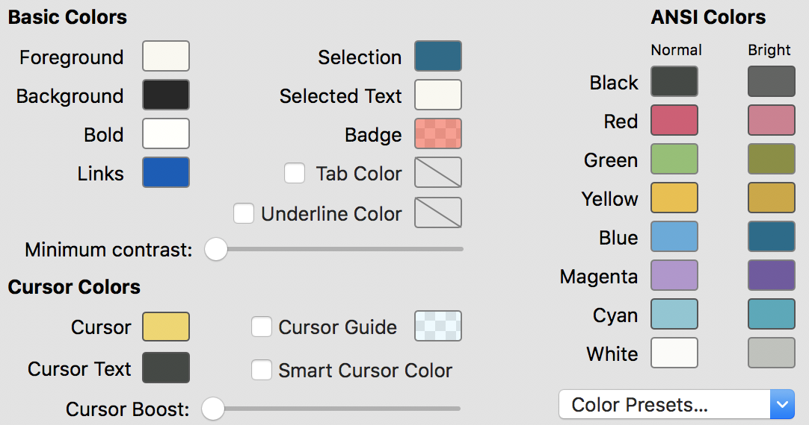
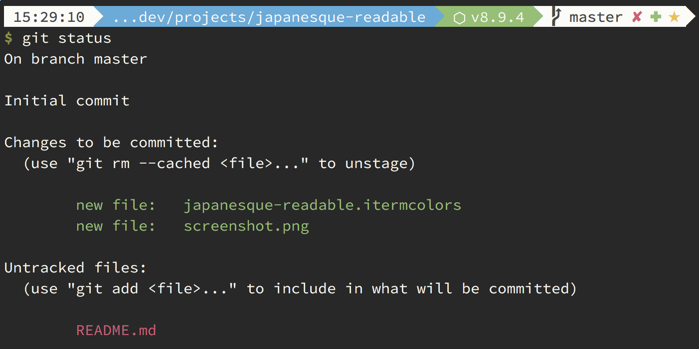

# Japanesque iTerm colors with proper contrast

Based on [the Japanesque color theme](https://github.com/mbadolato/iTerm2-Color-Schemes/blob/master/schemes/Japanesque.itermcolors) with adjusted colors for proper contrast and higher readability.

## iTerm color settings:

## Example:

